# 513bot

## コンテナ

| 名前 | 機能 | 必須 |
| :---: | :---: | :---: |
| [core-receiver](/core/README.md) | ボットにメンションされたメッセージを受信 | ◯ |
| [core-sender](/core/README.md) | チャンネルにメッセージを送信 | ◯ |
| [app-arxivreporter](/app-arxivreporter/README.md) | arXiv論文をGPT-3で毎朝要約 | × |
| [app-forecaster](/app-forecaster/README.md) | その日の天気予報を毎朝通知 | × |
| [app-info](/app-info/README.md) | メンションされたチャンネルのIDを通知（デバッグ用） | × |
| [app-shuffle](/app-shuffle/README.md) | 指定されたグループのメンバーをシャッフルして通知 | × |